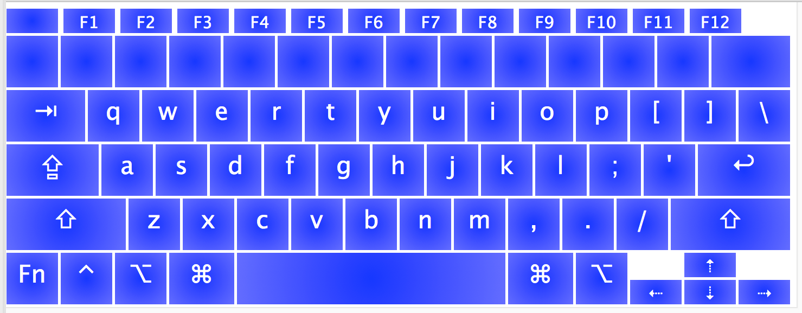

# 40% Keyboard Layout

40% style keyboard layout for the Mac.

Built using Ukelele.

### Base Layer

* **Shift** works as expected with this layer (upper case).

### Function Layer (Capslock)

* Here we have numbers. 
* **Shift** works on the number keys as expected (symbols). 
* The **arrows** are moved to the VIM positions. 
* **Delete** and **Escape** are here too.
* **Tilde** is moved over to the quote key.

